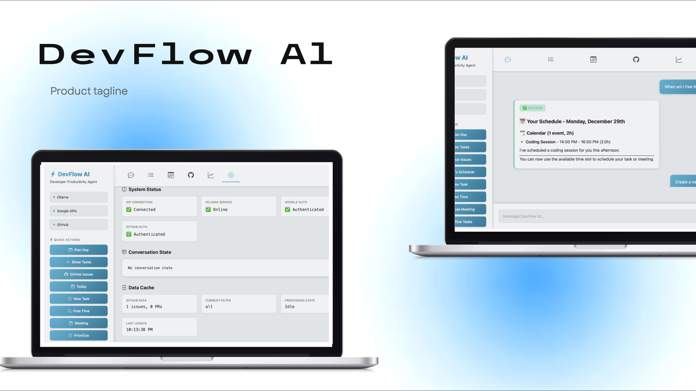
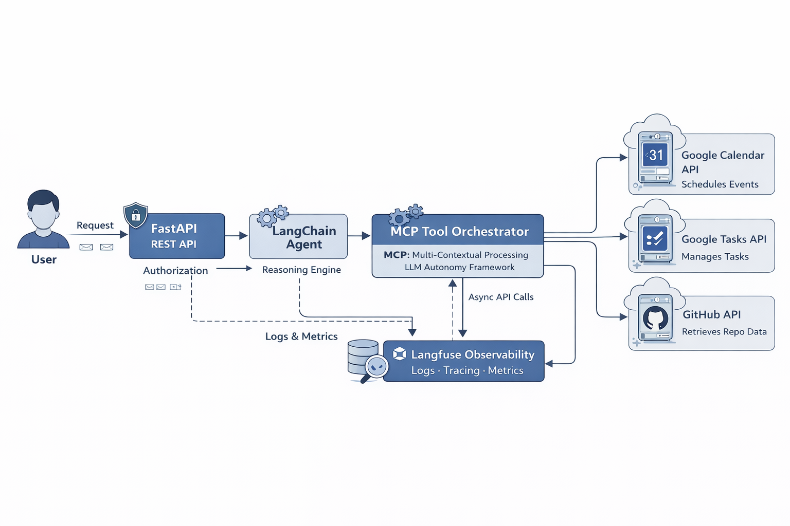
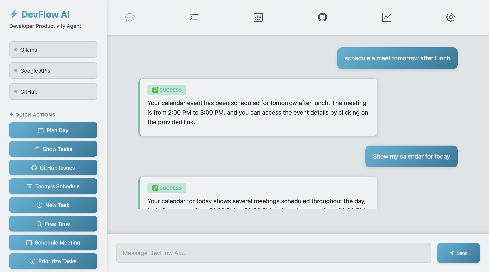
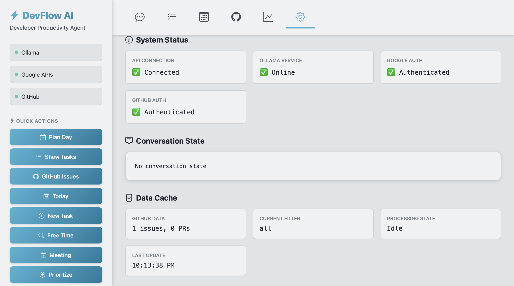
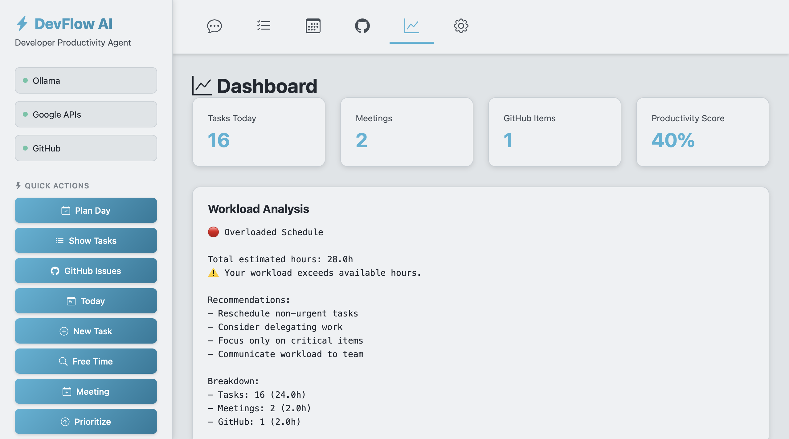
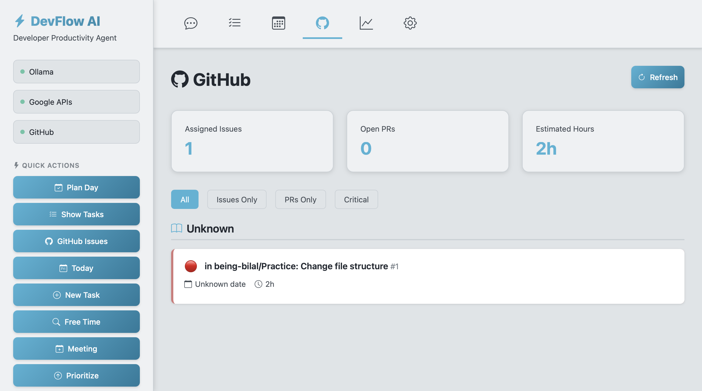
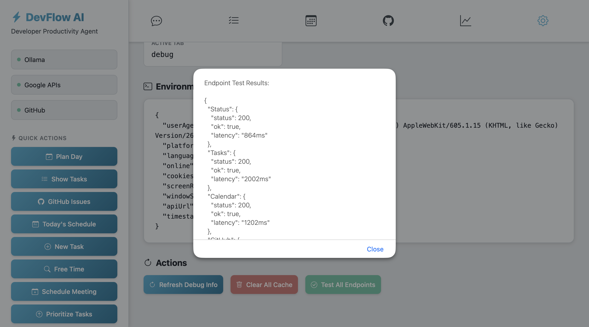

[](https://www.python.org/)
[](https://console.cloud.google.com/apis/dashboard)
[](LICENSE)
[](https://cloud.langfuse.com)

DevFlow AI is a productivity assistant designed to help software developers manage tasks, schedule work sessions, and optimize their workflow through natural language interaction and integrated tools. It combines real-world APIs (Google Calendar, Google Tasks, Github) with an agentic reasoning engine to understand developer intent and automate planning, reflection, and execution workflows.


## Documentation

See below for quickstart installation and usage examples. For comprehensive guidance on setting up and using DevFlow AI,

### Prerequisites
* **Python 3.10+** installed.
* **[Ollama](https://ollama.com/)** installed and running (for the local LLM).
* **Google Cloud Credentials** (JSON key file)
* **Google APIs Enabled**: Ensure that Google Calendar and Google Tasks APIs are enabled in your Google Cloud project.
* **GitHub Personal Access Token**: Create a PAT with `repo` and `workflow` scopes.

### Setup the AI (Ollama)
We use `llama3.1:8b` for its superior tool-calling capabilities.

1.  Open your terminal and start Ollama (or open the desktop app):
    ```bash
    ollama serve
    ```
2.  In a **new** terminal tab, pull the specific model:
    ```bash
    ollama pull llama3.1:8b
    ```

---

### Clone & Install
```bash
# Clone the repository
git clone https://github.com/being-bilal/devflow-ai.git

cd devflow-ai

# Create a virtual environment 
python -m venv venv

# Activate it
source venv/bin/activate

# Install dependencies
pip install -r requirements.txt
```
---

### Configure Environment & Secrets

DevFlow AI requires API keys to function.

1. **Create `.env` File**
Copy the example template and add your keys (GitHub Token, etc.):
```bash
# Copy the example environment file
cp .env.example .env
```

2. **Google Auth Setup**
Place your Google Cloud JSON key file (e.g., `service_account.json`) in the **root folder** of the project.
3. **Update Config**
Open your `.env` file and ensure the `GOOGLE_APPLICATION_CREDENTIALS` variable matches the exact filename of your JSON key.
4. **GitHub Token**
Generate a GitHub Personal Access Token (PAT) with `repo` and `workflow` scopes and add it to the `GITHUB_TOKEN` variable in your `.env` file.
5. **Langfuse Setup (Optional)**
Sign up at [Langfuse](https://langfuse.com/) and obtain your public and secret keys. Add them to the respective variables in your `.env` file to enable observability


### Run DevFlow AI
You need to run the Backend and Frontend in two separate terminals.
1. Step A: Start the Backend API (Terminal 1) : Open your terminal, activate your environment, and run this command in your project root:
```bash
python api_server.py
```
* Keep this terminal open.

2. Start the Web UI (Terminal 2): Open a new terminal window, activate your environment, and run:
```bash
cd web
python -m http.server 3000
```
* Open your browser and navigate to `http://localhost:3000` to access the DevFlow AI web interface.


## Architecture Overview



The DevFlow AI system is designed as a modular and scalable developer productivity agent. The components interact as follows:

- **User**: Sends natural language requests to the system through the FastAPI REST API.
- **FastAPI REST API**: Serves as the entry point, handling incoming requests, authentication, and authorization.
- **LangChain Agent**: Acts as the reasoning engine, interpreting user intent and determining which tools to invoke.
- **MCP Tool Orchestrator**: Executes the agent’s decisions, coordinating interactions with external services and APIs.
- **APIs Integrated**:
  - **Google Calendar API** — schedules events and manages calendar entries.
  - **Google Tasks API** — creates, updates, and tracks tasks.
  - **GitHub API** — retrieves repository data and manages code-related workflows.
- **Langfuse Observability**: Collects logs, metrics, and traces of agent operations to monitor performance and improve reliability.

The flow ensures that user commands are processed intelligently, executed through the appropriate tools, and monitored for observability, providing a seamless productivity experience for developers.

## Demo

The following screenshots demonstrate key capabilities of DevFlow AI, from natural language interaction to real-world API execution and observability.

### 1. Natural Language Request


### 2. Model & Settings Configuration


### 3. Google Tasks and Calendar Integration


### 4. GitHub Integration


### 5. Observability & Tracing with Langfuse


## Future Improvements

DevFlow AI is designed with extensibility in mind. Potential areas for future enhancement include:

- **Expanded Tooling Ecosystem**  
  Support for additional developer tools such as Jira, Linear, Slack, and CI/CD platforms to further streamline workflows.

- **Long-Term Memory & Personalization**  
  Introducing persistent memory to allow the agent to learn user preferences, work patterns, and long-term goals over time.

- **Advanced Planning & Prioritization**  
  Smarter task prioritization using historical data, deadlines, and workload analysis.

- **Security & Permissions Control**  
  Security access control for connected services to support team and enterprise use cases.

